# Hash Table Benchmark

This is yet another benchmark for hash tables(hash maps) with different hash
functions in C++, attempting to evaluate the performance of the lookup,
insertion, deletion, iteration, etc. on different data as comprehensively as
possible.

## Before viewing the results

If one is familiar enough with the world of hash tables, he/she will know that
even for a well-known and widely used hash table, there is a data distribution
that it's not very good at. In other words, no hash table is the fastest on all
datasets for all operations.

The best practice for selecting a hash table needs to consider the
characteristics of the data and the proportion of operations, fit the actual
needs and cooperate with the most suitable hash function.

This benchmark tries to use a concise and effective method to test the
performance of different operations of the hash table on some of the most common
data distributions. But in fact, there must be a data distribution that is very
different from the data we use for testing, and different users have different
requirements for different indicators. Therefore, the best test method is to
test in real applications.

## Methodology

### Test Items

We measure the combination of different hash tables with different hash functions.
For each combination, we measured its insert, delete, lookup (including successful
and failed lookups), and iteration performance under different data. Below is a
more detailed table of test items. Please note that in the following we will use
"hash table" or "hash map" indiscriminately to refer to the same concept.

| Index | Test items                                                              | Notes                                                                                                             |
|-------|-------------------------------------------------------------------------|-------------------------------------------------------------------------------------------------------------------|
| 1     | Insert with reserve                                                     | Call map.reserve(n) before insert n elements                                                                      |
| 2     | Insert without reserve                                                  | Insert n elements without prior reserve                                                                           |
| 3     | Erase and insert                                                        | Repeatedly do one erase after one insert, keep the map size constant                                              |
| 4     | Look up keys in the map (hit)                                           | Repeatedly look up the elements that are in the map                                                               |
| 5     | Look up keys that are not in the map (miss)                             | Repeatedly look up the elements that are not in the map                                                           |
| 6     | Look up keys with 50% probability in the map                            | Repeatedly look up the elements that have a 50% probability in the map                                            |
| 7     | Look up keys in the map with large max_load_factor (hit)                | Same as Test Item 4 except that the map is set a max_load_factor of 0.9 and rehashed before the lookup operations |
| 8     | Look up keys that are not in the map with large max_load_factor (miss)  | Same as Test Item 5 except that the map is set a max_load_factor of 0.9 and rehashed before the lookup operations |
| 9     | Look up keys with 50% probability in the map with large max_load_factor | Same as Test Item 6 except that the map is set a max_load_factor of 0.9 and rehashed before the lookup operations |
| 10    | Iterate the table                                                       | Iterate the whole table several times                                                                             |
| 11    | Heap memory size and load factor with default and large max_load_factor | Record the heap memory size and load factor when construct the map in Test Item 4, 7                              |

As you may have noticed, several of the test items are set to test the query
speed of hash tables with a larger upper limit on the load factor (the load
factor is an important data indicator to measure how full the hash table is,
max_load_factor is an API for maximum load factor in STL). This is because
each hash table may have a different expansion strategy and max_load_factor,
so even with the same number of elements, they will choose different load
factors, which will cause them to occupy different memory space. The load factor
and size of the memory space occupied greatly affects the lookup performance, so
using a hash table with a smaller max_load_factor may have worse (or better)
performance when looking up. On the other hand, a higher load factor may
lead to a higher probability of collision, thus reducing the lookup performance.

In addition, if a user wants extreme lookup time,
he/she probably needs to make the space used by the hash table as small as
possible to reduce the cache miss rate. Or, when the available size of memory
is very limited, a larger load factor may be preferred. Then one of the
things that can be done is to set a higher max_load_factor, and then rehash
(or set a large max_load_factor before the main construction process of the
table).

For each of the tests above, we tested the throughput and latency
(when the platform under test meets the conditions for the latency test). The
throughput results will be more representative, because modern software runs
on CPUs with pipelined architectures. And almost all operations will have other
instructions before and after them, which can make full use of the pipeline.
However, for some specific uses, latency data is important.
The latency measurement results here are for reference only for special needs
and have relatively large limitations.

### Dataset

All the data used in the benchmark are randomly generated, the user can choose
different seeds for the test data. We tested the performance of each hash table
at different sizes from 32 to 10^7.

The tested keys consist of 64-bit integers of different distributions and
strings of different lengths. The detailed test data is shown in the table
below.

| Index | Key Type                                           | Value Type      | Notes                                                                                                                                                                                                                                                                                                                                                                                                                                                                                                                                    |
|-------|----------------------------------------------------|-----------------|------------------------------------------------------------------------------------------------------------------------------------------------------------------------------------------------------------------------------------------------------------------------------------------------------------------------------------------------------------------------------------------------------------------------------------------------------------------------------------------------------------------------------------------|
| 1     | uint64_t with several split bits masked            | uint64_t        | The keys have such characteristics: only bits in some positions may be 1, and all other bits are 0. For test data of size n, at most ceil[log2(n)] fixed bits may be 1. e.g. If the key type is uint8_t (it is uint64_t in reality) and the test size is 7, the keys will be generated with the method `rng() & 0b10010001`. The distribution characteristics of such bits can relatively comprehensively examine whether hash tables and hash functions can handle keys that only have effective information in specific bit positions. |
| 2     | uint64_t, uniformly distributed in [0, UINT64_MAX] | uint64_t        | The keys follow a uniform distribution in the range [0, UINT64_MAX].                                                                                                                                                                                                                                                                                                                                                                                                                                                                     |
| 3     | uint64_t, bits in high position are masked out     | uint64_t        | The bits in the high position are set to 0. For test data of size n, at most ceil[log2(n)] fixed bits may be 1. For example, if the key type is uint8_t (uint64_t in reality) and the test size is 7, the keys will be generated with the method `rng() & 0b00000111`                                                                                                                                                                                                                                                                    |
| 4     | uint64_t, bits in low position are masked out      | uint64_t        | The bits in the low position are set to 0. For test data of size n, at most ceil[log2(n)] fixed bits may be 1. For example, if the key type is uint8_t (uint64_t in reality) and the test size is 7, the keys will be generated with the method `rng() & 0b11100000`                                                                                                                                                                                                                                                                     |
| 5     | uint64_t with several bits masked                  | 56 bytes struct | The keys are the same as the distribution of the data 1. The payload is a 56 bytes long struct, which makes the `sizeof(std::pair<key, value>)==64`                                                                                                                                                                                                                                                                                                                                                                                      |
| 6     | Small string with a max length of 12               | uint64_t        | The key type is a string with a maximum length of 12. Both length and characters are randomly generated. The Small String Optimization(SSO) technique may be taken by the compiler.                                                                                                                                                                                                                                                                                                                                                      |
| 7     | Small string with a fixed length of 12             | uint64_t        | The key type is a string with a fixed length of 12. The characters are randomly generated. The Small String Optimization(SSO) technique may be taken by the compiler.                                                                                                                                                                                                                                                                                                                                                                    |
| 8     | Mid string with a max length of 24                 | uint64_t        | The key type is a string with a maximum length of 24. Both length and characters are randomly generated.                                                                                                                                                                                                                                                                                                                                                                                                                                 |
| 9     | Mid string with a fixed length of 24               | uint64_t        | The key type is a string with a fixed length of 24. The characters are randomly generated.                                                                                                                                                                                                                                                                                                                                                                                                                                               |
| 10    | Large string with a max length of 64               | uint64_t        | The key type is a string with a maximum length of 64. Both length and characters are randomly generated.                                                                                                                                                                                                                                                                                                                                                                                                                                 |
| 11    | Large string with a fixed length of 64             | uint64_t        | The key type is a string with a fixed length of 64. The characters are randomly generated.                                                                                                                                                                                                                                                                                                                                                                                                                                               |

Different distributions within the range representable by uint64_t are chosen as
keys. Uniformly distributed integers in the range of uint64_t are the easiest to
generate with pseudo-random numbers, but it is rare in real situations.

If users are concerned with performance using integer keys, we strongly
recommend focusing on the results on the first dataset rather than the second
dataset (i.e. the dataset with a uniform random distribution). Because the
data from the first dataset better can examine the ability of hash tables
and hash functions to deal with more diverse patterns, while the test on 
uniform random distribution barely verifies the ability of hash tables
to handle other distributions. Moreover, in terms of the data distributions
that exist today, few keys happen to be uniformly randomly distributed over
the [0, 2^63 - 1] range.

For the string datasets, different character sets are used. For the fixed length
string, the pattern is like the first dataset, where several split bits are
masked. In other words, only the bits on in some positions may diff among the
these datasets. This pattern is aimed to test the quality of the hash function.

For the strings with variable length, a subset of the printable characters can
appear in the string.

Real data distributions are often biased. And if a combination of hash function
and hash table can only handle one distribution and cannot handle other
distributions, this combination is not robust to unknown distributions. If the
distribution of the data is known in advance, the user can pick the fastest and
most stable hash table for that data.

### Tested Hash functions and Hash maps

Below is the hash function list we tested

| Name                    | Type   | Notes                                                                                                                          | Link                                           |
| ----------------------- |--------|--------------------------------------------------------------------------------------------------------------------------------| ---------------------------------------------- |
| std::hash               | Normal | Implemented by compiler; identity hash is used for integer type in libc++ and libstdc++                                        |                                                |
| absl::hash              | Normal | Implemented by google; Use 128-bit product of multiplication and a xor-shift.                                                  | https://github.com/abseil/abseil-cpp           |
| robin_hood::hash        | Normal | For integer keys, it use xor-shift, multiplication, xor-shift; For string keys it is similar to MurmurHash                     | https://github.com/martinus/robin-hood-hashing |
| xxHash_xxh3             | Bytes  | Designed for string; We use identity hash for integer type to pass compilation; Results on integer keys will not be displayed. | https://github.com/Cyan4973/xxHash             |

Originally we have some seed hash functions in the tests, which are hash
functions that take both a key and a seed as the arguments. We remove these hash
functions to keep the test subjects simple, and we use the no-seed version of
all the hash tables.

We will not show the results of hash `xxHash_xxh3` in tests on integer keys.
For the early versions of `absl::Hash`, the behavior on arm64 platform is
different from that on x86-64 platform, and it was poor for some datasets. So
we once had a `uint128_mul::hash` to compare with it, which is similar to the
`absl::Hash` on x86-64 platform. Since the newest version of `absl::Hash` has
fixed this problem. We deleted the `uint128_mul::hash`.

The following table lists the hash tables we tested, some of these hash tables
rely on a "good" hash function to work properly, which can generate hash values
that are as uniformly distributed as possible for unbalanced keys. If a hash
function that does not have such property (e.g. identity hash) is used, then
the performance of these hash tables may drop drastically. These hash tables
may have the assumption that the hash values of the keys from the dataset are
uniformly distributed in the output range. This requires the hash functions to
have the properties like uniformity or diffusion.

The implication here is that a "good" hash function tends to be more complex
than the simplest hash function (the identity hash), requiring more instructions
to complete the computation. Some hash tables do not rely on a good
hash function, may due to that they have done some extra work to ensure the
uniformity of the hash values. For such a hash table, the simpler the hash
function, the better, preferably the identity hash. So we should always compare
the combinations of hash tables and hash functions, rather than fixing the
hash function to compare the hash table, or vice versa.

Here are the hash maps we tested.

| Name                          | Require good hash function | Notes                                                                                                                  | Link                                       |
|-------------------------------|----------------------------|------------------------------------------------------------------------------------------------------------------------|--------------------------------------------|
| std::unordered_map            | No\*                       | Implemented by the stl library; May differ in libc++ and libstdc++.                                                    |                                            |
| ska::flat_hash_map            | No                         | Very fast and simple; Use robin hood hash; Memory overhead: alignof(value_type) per element; Require small load factor | https://github.com/skarupke/flat_hash_map  |
| ska::bytell_hash_map          | No                         | A little slower than ska::flat_hash_map but one byte per element memory overhead                                       | https://github.com/skarupke/flat_hash_map  |
| absl::flat_hash_map           | Yes                        | Use SIMD and metadata; Fast when looking up keys that are not in the map; One byte per element memory overhead         | https://abseil.io/about/design/swisstables |
| absl::node_hash_map           | Yes                        | Slower than absl::flat_hash_map but does not invalidate the pointer after rehash                                       | https://github.com/abseil/abseil-cpp       |
| tsl::robin_map                | Yes                        | A fast hash table using robin hood hash; Memory overhead is no less than ska::flat_hash_map                            | https://github.com/Tessil/robin-map        |
| emhash::HashMap7              | Yes                        | Fast in lookup hit operations.                                                                                         | https://github.com/ktprime/emhash          |
| fph::DynamicFphMap            | No                         | A dynamic perfect hash table; Ultra-fast in lookup but slow in insert; 2~8 bits per element memory overhead            | https://github.com/renzibei/fph-table      |
| fph::MetaFphMap               | No                         | A dynamic perfect hash table using metadata; Better than fph::DynamicFphMap in the miss lookup case.                   | https://github.com/renzibei/fph-table      |
| robin_hood:unordered_flat_map | Yes                        | A table using robin hood hash;                                                                                         |                                            |

\* Note: For the tested libc++ and libstdc++ version, the libc++ implementation
requires a good hash function but no such requirement for libstdc++.

With a quick glance you can easily find that many hash tables listed use the
[robin hood hashing](https://cs.uwaterloo.ca/research/tr/1986/CS-86-14.pdf)
technique in the pursuit of speed.

## Build

### Requirements

OS: Linux, macOS, or Windows

Compiler: Only GCC and Clang have been tested; You may test with MSVC and
contribute to the benchmark. The compiler has to support C++17 or newer
standard.

Build Tool: CMake >= 3.10

### Steps

First, clone this repo to the machine, then update the submodules

```bash
cd hashtable-bench
git submodule update --init --recursive
```

Use CMake to make the targets

```bash
mkdir build
cd build
cmake .. -DCMAKE_BUILD_TYPE=Release # (default option: -DBENCH_ONLY_INT=OFF -DBENCH_ONLY_STRING=OFF)
make -j8
```

Use the python script provided to run all the tests in the benchmark. If you are using linux, you may change the core
affinity settings in it (which is at the beginning of that script) or use the external taskset command to set the core
affinity of the python process.

```bash
cd ../tools
python3 run_bench.py seed export_results_directory_path
```

The results of the tests will be in the format of `csv` files. You can use the jupyter notebook
`tools/analyze_results.ipynb`  to parse and generate plots of the results.

## Features


- One can easily add new hash functions and hash maps.
- Data with different distributions, different characteristics, and different types are tested.
- Tested as many operations on hash tables as possible.
- Provides a convenient tool for visualizing test results.
- Support the hash tables with a seed hash function (which takes both a key and a seed as the function arguments) like
[Flash Perfect Hash](https://github.com/renzibei/fph-table).

## How to add a new hash function or hash table

One can follow the samples in `src/hashes/std_hash` and `src/maps/std_unordered_map`. If the new hash function or the
hash map has a repo in the GitHub, you can add it as a submodule (put in `thirdparty/`) and then use CMake `addsubmodule`
or just add the include directories.

After the new hash directory or hash map directory is added, run the CMake command to generate the build targets.

## Restrictions

### Exclusive access to resources
In our tests, almost all computer resources can be monopolized by the test
program, especially cache resources. And this is relatively rare in practical
applications. In fact, other processes and tasks may occupy part of the cache.
In practical applications users should expect a lower available cache size.

### Cold memory and warm cache
We neither did a warmup, nor did we specifically test the cold start scenario.
In our tests, we repeatedly test an operation with a range of data many times.
Therefore, when the number of operations is much greater than the amount of
data, it can be considered that most operations are accessing the warm cache.
When the number of operations is less than the number of data, most operations
are accessing cold memory. In our test, limited by the test time, when the
amount of data is small, the number of operations will be much greater than
the amount of data; and when the amount of data is large, the number of
operations will be equal to the amount of data.

### Huge test space
The size of the test space contains at least 
```
|hash table set| x |hash function set| x |data sets| x |operation set| x |hardware platform set| x |compiler set|
```
As you can see, the testable space is quite huge. Any addition to the set of hash
tables or the set of hash functions will greatly increase the testing effort.
Due to time and resource constraints, we have only explored some of the
combinations, and there are still many combinations and spaces that we have not
tested.

## Results

Here we show part of the test results. For complete test results, users can visualize the csv data using the tools we
provide.

For throughput data, performance will be represented by the average time per
operation. We will plot the average time per operation for different scales of
data. The shorter the time, the better the performance.

If too much time is spent in a test, we will count it as the timeout and set the
time as zero, and that data point won't be plotted.

### Testing Platform

Platform 1: Intel(R) Xeon(R) E-2286G CPU @ 4.00GHz, boost to 4.6 GHz;
32 GB 2666 MHz dual channel DDR4 RAM; Ubuntu 20.04; gcc 9.4.0; x86-64; Coffee Lake;

Platform 2: M1 Max Macbook Pro 16 inch, 2021; 64 GB quad channel LPDDR5 RAM;
macOS 12.1; clang 13.1.6; arm64; Firestorm;

Due to the lack of high-precision time stamp counters available on other
platforms, we only measured the latency on the x86-64 platform. In addition,
for the x86-64 platform, we have also taken some measures to ensure the
stability of the measurement results, including the following:

1. Use the `taskset` command to set cpu core affinity
2. Turn off hyperthreading
3. Isolate the cores by add `isolcpus=` and `rcu_nocbs=` in `GRUB_CMDLINE_LINUX`
in `/etc/default/grub`
4. Turn off some powersaving option, including disable `ondemand` systemd service,
set `idle=poll` and `intel_idle.max_cstate=0` in grub cmd line.
5. Turn off timer tick interrupts, recompile the kernel with
`CONFIG_NO_HZ_FULL=y` and set `nohz_full=` in grub cmd line.
6. Other adjustments that de-jitter the system latency. You can refer to
[https://rigtorp.se/low-latency-guide/](https://rigtorp.se/low-latency-guide/).

These measures cannot be done on macOS. But as we do not measure the latency of
operation on macOS, it doesn't matter that much.

### <K,V>: <uint64_t with several split bits masked, uint64_t>

#### Look up keys in the map with large max_load_factor


<center>Figure 1: Look up keys in the map with 0.9 max_load_factor, tested in AMD 3990x</center>


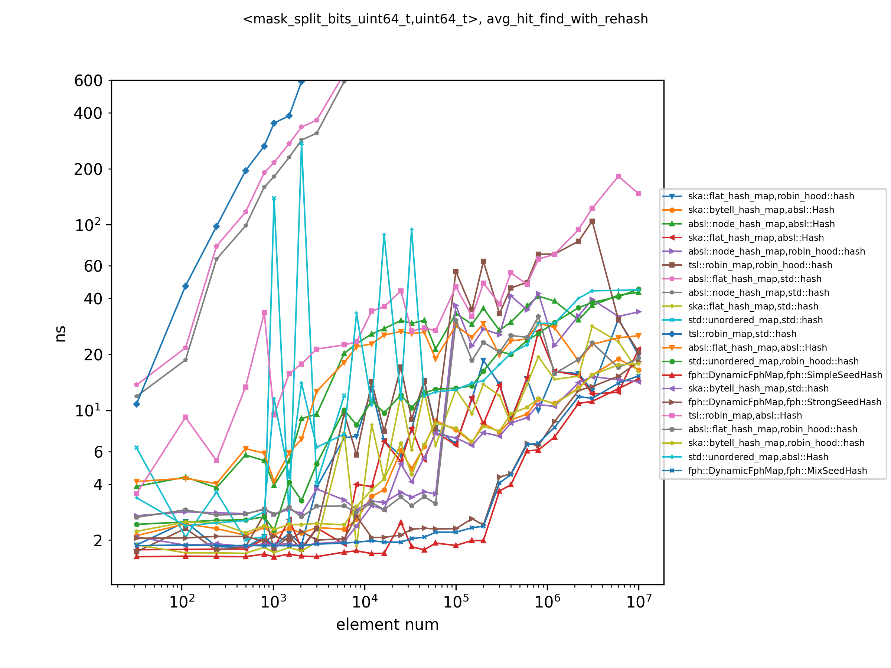

<center>Figure 2: Look up keys in the map with 0.9 max_load_factor, tested in Apple M1 Max</center>

#### Lookup keys in the map with default max_load_factor

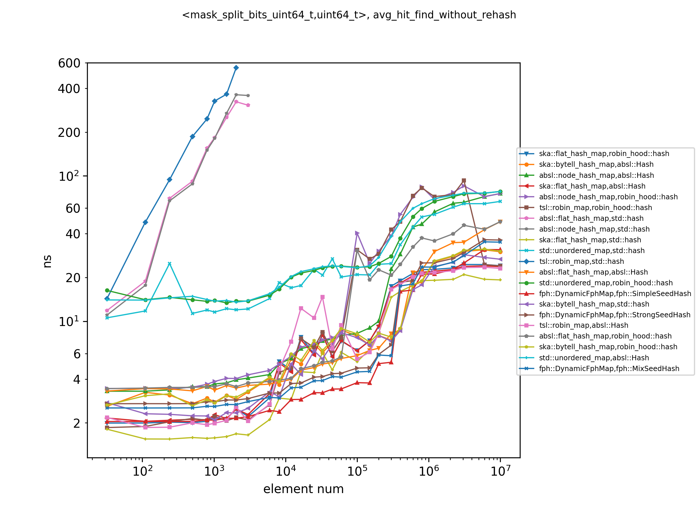

<center>Figure 3: Look up keys in the map with default max_load_factor, tested in AMD 3990x</center>

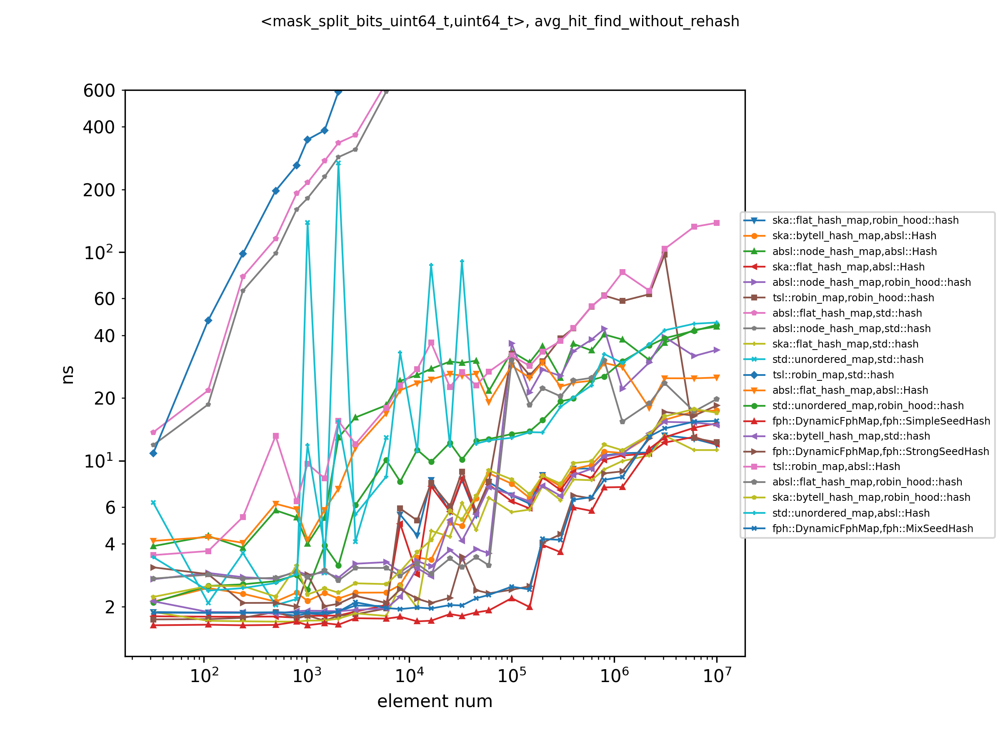

<center>Figure 4: Look up keys in the map with default max_load_factor, tested in Apple M1 Max</center>

#### Look up keys that are not in the map with large max_load_factor

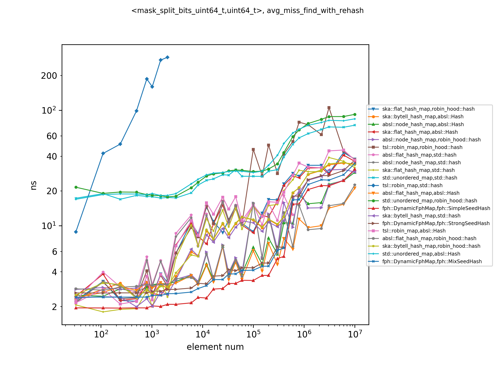

<center>Figure 5: Look up keys that are not in the map with 0.9 max_load_factor, tested in AMD 3990x</center>

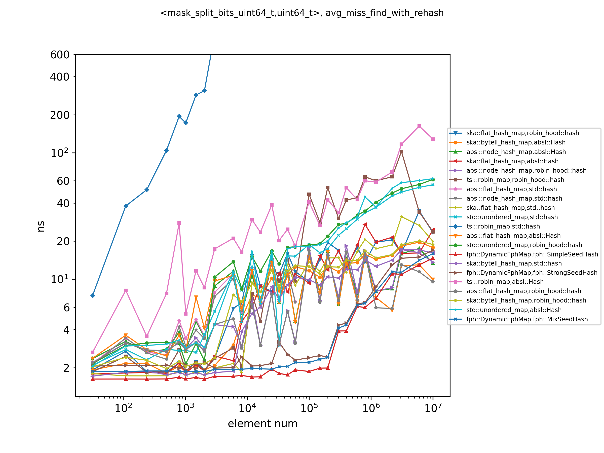

<center>Figure 6: Look up keys that are not in the map with 0.9 max_load_factor, tested in Apple M1 Max</center>

#### Analysis of lookup integer keys

The first thing we need to be clear about is that the lookup performance of the hash table is directly related to the
cache hit rate. So one can see clearly from figure 1 that in x86-64 architecture, the performance of the query is
roughly divided into four levels by the number of elements:

1. Elements can be fully loaded into the L1 cache; When sizeof(value_type) is 16 bytes and the L1 data cache is 32 KB,
there can be about 2048 elements at most
2. Elements can be fully loaded into the L2 cache; When sizeof(value_type) is 16 bytes and the L2 cache is 512 KB,
there can be about 32768 elements at most
3. Elements can be fully loaded into the L3 cache; When sizeof(value_type) is 16 bytes and the L2 cache is 16 MB,
there can be about 10^6 elements at most
4. A lot of reads from RAM are bound to occur; When L3 cache can not fully contain the elements, here is roughly when
there are more than 10^6 elements

In addition to the cache miss, TLB miss is also a major factor affecting the lookup speed of hash tables. Zen2 has
64 L1 TLB entries and 2048 L2 TLB entries. This means if a 4KB page size is used, there will be a lot of L1 TLB miss
when the number of elements is larger than 16384 and L2 TLB miss when the number is larger than 524288. If huge pages
are used, there can be far less TLB miss. On macOS using m1 max, a 16 KB page size is used by default. So the penalty
caused by TLB miss is much smaller than the default setting of the zen2 platform.

When the task is to find an element in a hash table, from figure 1 and figure 2, we can see that in x86-64
(more specifically, tested in zen2) architecture, with a large max_load_factor, when the size of elements is smaller
than 1000,  `ska::flat_hash_map` with `std::hash` is the fastest combination of hash tables. When the number of elements
exceeds 1000, `fph::DynamicFphMap` with `fph::SimpleSeedHash` is the fastest in lookup.

In arm64 (tested in Apple Silicon) architecture, `fph::DynamicFphMap` with `fph::SimpleSeedHash` has the fastest
lookup speed regardless of the number of elements. `ska::flat_hash_map` with `std::hash` are also very competitive with
less than 2000 elements.

In addition, we can find that for those hash tables that require the quality of the hash function, the lookup performance
on this data distribution is poor when using `std::hash`. By contrast, for those hash tables that do not rely on good
hash functions (such as `ska::flat_hash_map` and `fph::DynamicFphMap`), simpler hash functions (such as `std::hash` and
`fph::SimpleSeedHash`) can make their lookup operations faster because less time is spent on hash functions.

According to our observations, the current implementation of `absl::hash` on the arm64 architecture is not quite good as
it cannot make good use of the information of the higher bits of the integer key value (which is more obvious on the
datasets where the lower bits of keys are masked out.). `uint128_mul::hash`, which does not use the fallback method, is
very fast on the arm64 platform.

Comparing figure 1 and figure 3, we can also see that some hash tables with a larger load factor have better lookup
performance, such as DynamicFphMap, because of less memory usage and low cache miss rate. Some hash tables, such as
ska::flat_hash_map and tsl::robin_map, perform worse for a larger load factor, possibly because the collision rate
becomes higher.

Observing Figure 5 and Figure 6, it can be concluded that for looking up elements that are not in the hash table, when
the number of elements is not very large (more specifically, all elements can fit in the L3 cache), the
`fph::DynamicFphMap` has the fastest lookup speed; and when the number of elements becomes larger,
`absl::flat_hash_map` has the fastest lookup speed. `absl::flat_hash_map` can have such high query performance in this
scenario is understandable, because it uses a metadata table of 1-byte per element and SIMD instructions, which means
that it can determine whether the key to be looked up is contained in a dozen possible positions. The 1 byte metadata
per element needs much smaller space to store than the complete element array, so the cache hit rate is much higher than
other hash tables.

#### Insert with reserve

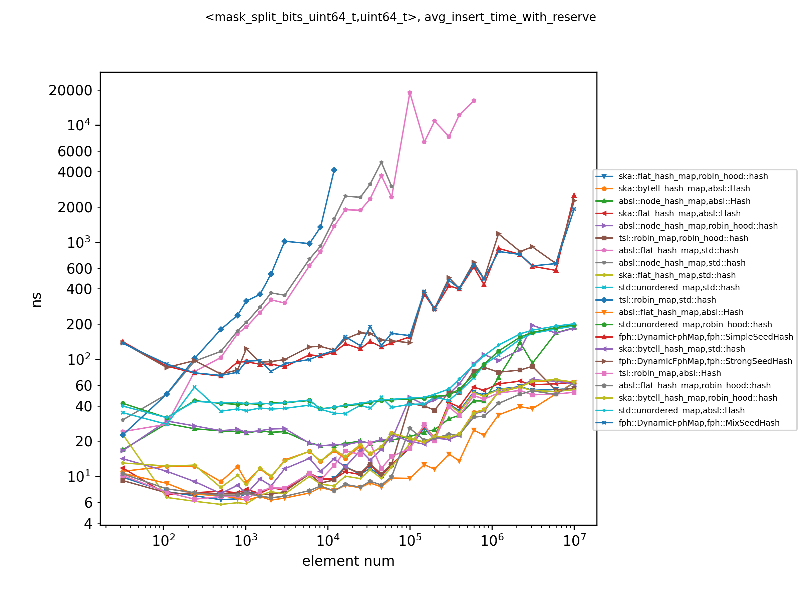

<center>Figure 7: Insert keys into the map with a prior reserve, tested in AMD 3990x</center>

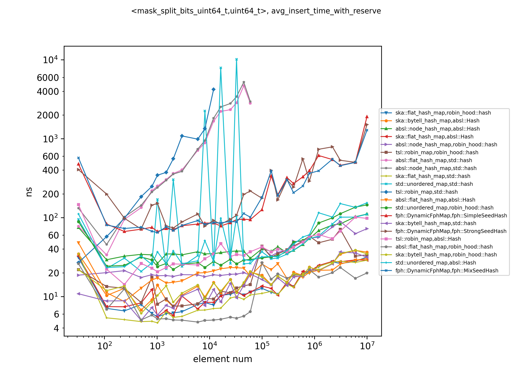

<center>Figure 8: Insert keys into the map with a prior reserve, tested in Apple M1 Max</center>

From Figure 7 and Figure 8, it can be found that hash `ska::flat_hash_map` with `std::hash` has excellent performance
when the number of elements is small. When the number of elements becomes too large to fit in the L2 cache,
`absl::flat_hash_map` has the highest performance with a suitable hash function (such as hash `absl::hash` in x86-64
or `uint128_mul::hash`).

#### Erase and insert

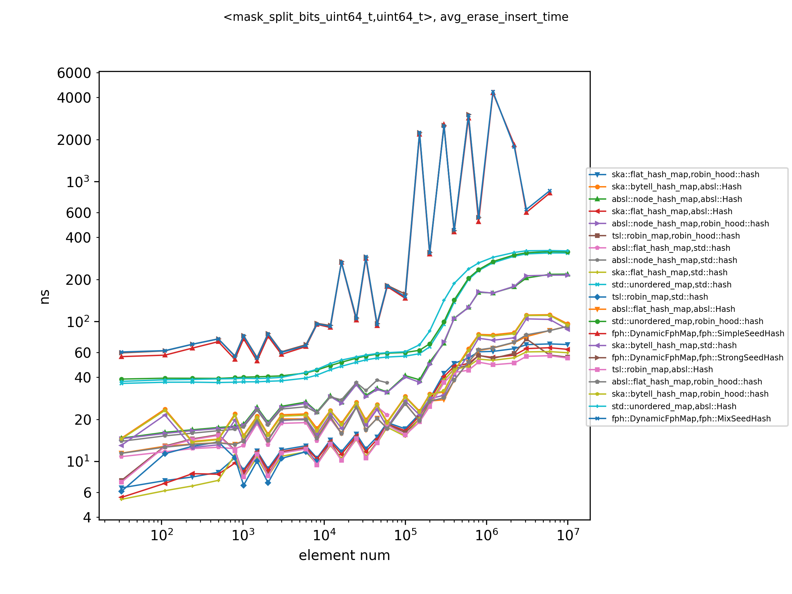

<center>Figure 9: Erase and Insert keys, tested in AMD 3990x</center>

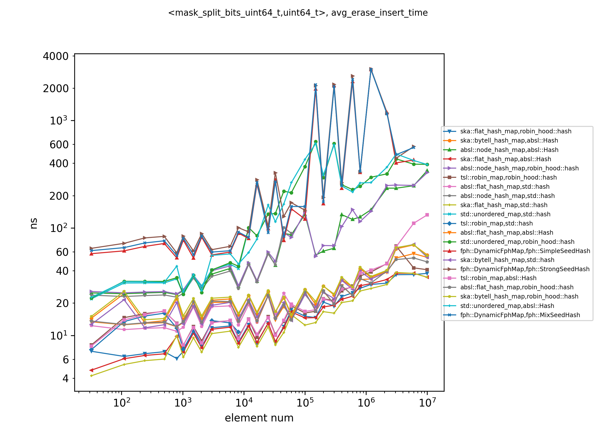

<center>Figure 10: Erase and Insert keys, tested in Apple M1 Max</center>

It should be noted that the results of this test are also highly correlated with the distribution of the data. Especially the relationship between deleted data and inserted data. Here we are randomly selecting elements to delete with equal probability. In reality, the way of selecting elements may not be equal probability, for example, the most likely deleted element is the most recently inserted element.

In this test, `ska::flat_hash_map` has almost the best erase and insert performance regardless of the number of
elements. `tsl::robin_map` performs almost as well with more than 1000 elements.

#### Iterate

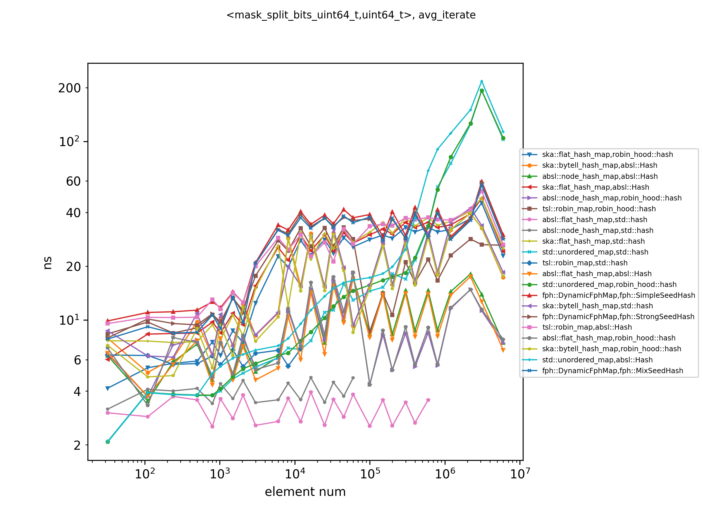

<center>Figure 11: Iterate the table, tested in AMD 3990x</center>

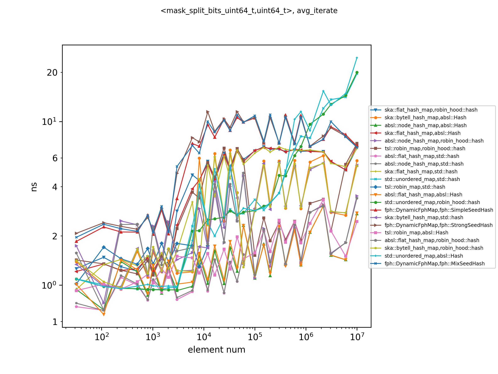

<center>Figure 12: Iterate the table, tested in Apple M1 Max</center>

Although the combination of `absl::flat_hash_map` and `absl::node_hash_map` with `std::hash` iterate very fast when
the amount of data is small, it can be seen that they have no test results when the amount of data is large. This is
because these combinations insert elements so slowly that they time out. So they shouldn't be included in the statistics
of the fastest iterating hash table.

When the amount of data is small, the iteration speed of `std::unordered_map` is unexpectedly fast. And when the amount
of data begins to increase, `absl::flat_hash_map` and `absl::node_hash_map` become the fastest iterative hash maps.

### <K,V>: <uint64_t with several split bits masked, 56 bytes struct>

Due to space limitations, comprehensive results are not presented in this document.

#### Look up keys in the map with large max_load_factor


<center>Figure 13: Look up keys in the map with 0.9 max_load_factor, tested in AMD 3990x</center>

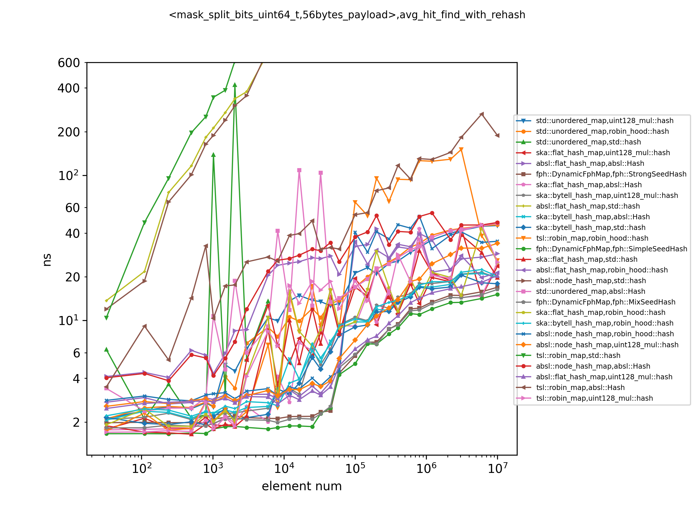

<center>Figure 14: Look up keys in the map with 0.9 max_load_factor, tested in Apple M1 Max</center>

We can see that the relative performance of the hash tables is similar when using uint64_t as the payload.

On x86-64 platform, `ska::flat_hash_map` is still excellent when the number of elements is small, and the lookup
performance of `fph::DynamicFphMap` is the best when the number of elements is large.

On the arm64 platform, `fph::DynamicFphMap` using `fph::SimpleSeedHash` has always been the fastest hash table in lookup.

Since the size of a single element becomes larger, it is easier for the cache hit rate to drop due to the increase in
the number of elements.

### <K,V>: <Small string with max length of 12, uint64_t>

#### Look up keys in the map with large max_load_factor

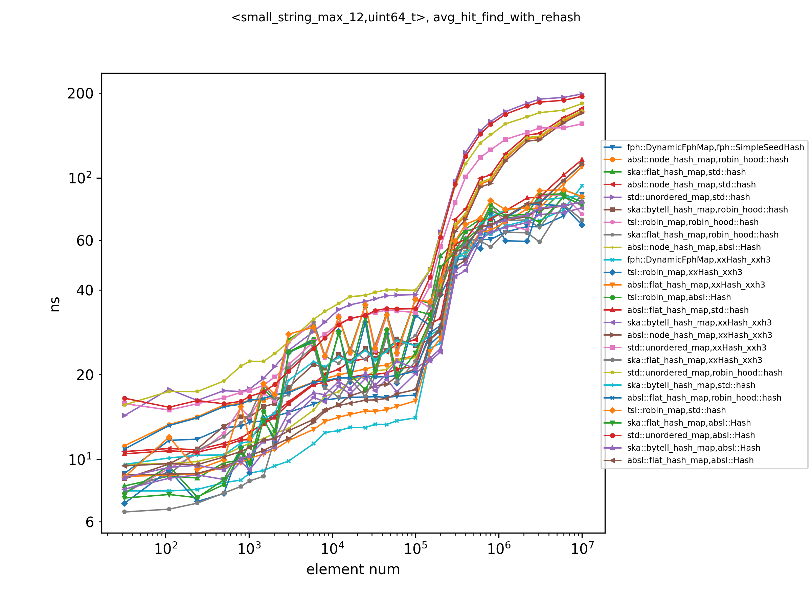

<center>Figure 15: Look up keys in the map with 0.9 max_load_factor, tested in AMD 3990x</center>

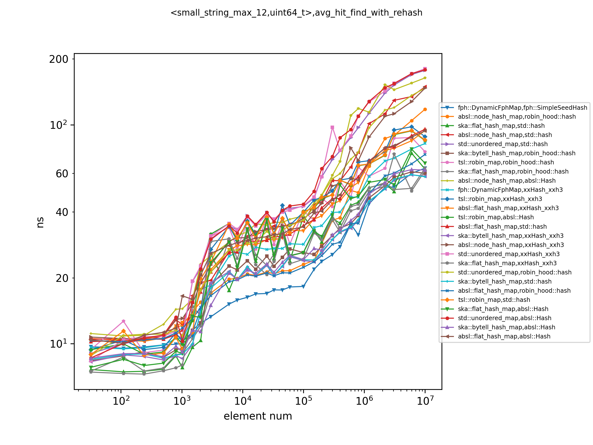

<center>Figure 16: Look up keys in the map with 0.9 max_load_factor, tested in Apple M1 Max</center>

Comparing different hash functions, it can be found that on the x86-64 platform, `xxHash_xxh3` is almost the fastest on
each data scale for this dataset. By contrast, `robin_hood::hash` is faster on the arm64 platform.

When the amount of data is very small or very large, `ska::flat_hash_map` is the fastest hash map for lookup. And when
the data size is medium, `fph::DynamicFphMap` has the best query performance.

This dataset is what we consider the least representative because there are too many random parameters for strings of
indeterminate length. At least compared to fixed-length strings, the distribution characteristics of the length of a
string can only be determined by specific problems. Names, English words, place names, stock codes, identity numbers,
base64 encoding of md5, etc. all have different length distributions. Therefore, the difference between the datasets
whose keys are strings is too great. If there is a need, users should test it against their actual data.

The lengths of the strings here are roughly uniformly distributed between approximately 1 and the maximum length. It is
said to be "roughly" because it is not completely uniform. The shorter the length, the less the selection space of the
string. For example, if the dictionary has only 26 letters, a string of 1 length can only hold 26 combinations. This
results in more strings with longer lengths than strings with shorter lengths.

### <K,V>: <Small string with fixed length of 12, uint64_t>

#### Look up keys in the map with large max_load_factor

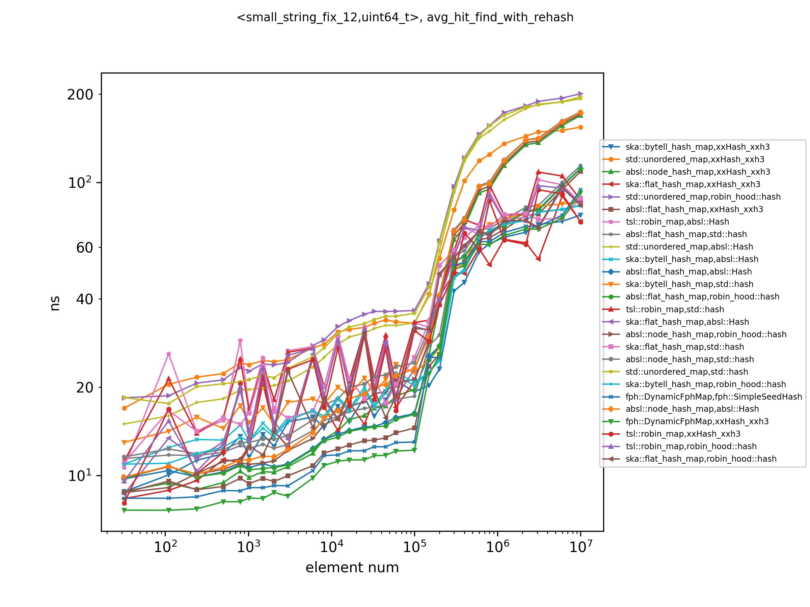

<center>Figure 17: Look up keys in the map with 0.9 max_load_factor, tested in AMD 3990x</center>

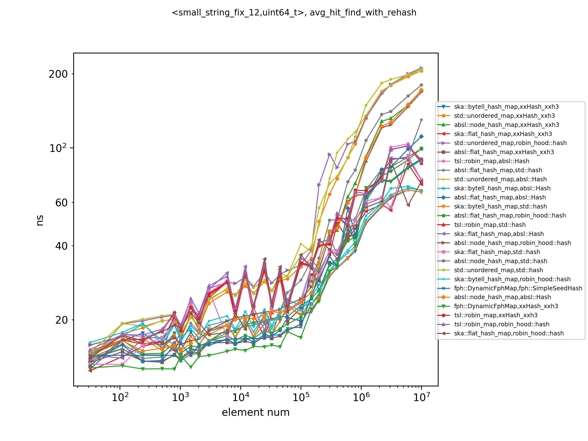

<center>Figure 18: Look up keys in the map with 0.9 max_load_factor, tested in Apple M1 Max</center>

For strings of fixed length 12, `fph::DynamicFphMap` is the fastest in lookup operations for almost any number of
elements on the x86-64 platform. `ska::flat_hash_map` and `ska::bytell_hash_map` also have fairly good lookup speed
when the number of elements is large. On the arm64 platform, `ska::bytell_hash_map` dominates test results with a very
large number of elements.

For the hash functions participating in the test, hash `xxHash_xxh3` can make the hash table play the fastest lookup
performance. But does this mean that `xxHash_xxh3` is the fastest for a fixed 12-byte string? It's not that simple.
In general, hash functions designed for byte arrays (strings) need to consider various odd byte lengths and various
memory alignment lengths. Therefore, these hash functions generally use unaligned fetch methods to avoid undefined
behavior. And the branches and non-trivial instructions brought about by these considerations can make the hash function
slower. If we already know that the length of the string is a fixed 12 bytes (or other bytes) and the memory is aligned
to machine word width, we can design a faster hash function.

For example, below is a hash function with seed for 12 bytes data. This is not a good hash function in the usual sense,
but it is a very fast and good enough hash function for `fph::DynamicFphMap`. This function assumes that the starting
address of the input data is 8-byte aligned, and the data length is fixed at 12 bytes, so no dirty special handling is
required.

```c++
inline uint64_t Hash12Bytes(const void* src, size_t seed) {
    uint64_t v1 = *reinterpret_cast<const uint64_t*>(src);
    uint32_t v2 = *reinterpret_cast<const uint32_t*>(((const uint64_t*)src) + 1);
    v1 *= seed;
    v1 ^= v2;
    return v1;
 }
```

Figure 19 compares the lookup performance of this hash function and `xxHash_xxh3` when used with `fph::DynamicFphMap`.


<center>Figure 19: Look up keys in the map with 0.9 max_load_factor, tested in AMD 3990x</center>

Figure 19 clearly shows that the specially designed hash function for 12bytes is faster  than the more general hash
function `xxHash_xxh3` when used with `fph::DynamicFphMap` at any data scale.

Therefore, if the user is looking for the ultimate performance, then when the key is a short fixed-length string, an
optimized hash function should be provided for the hash table.

### <K,V>: <Mid string with max length of 56, uint64_t>

#### Look up keys in the map with large max_load_factor

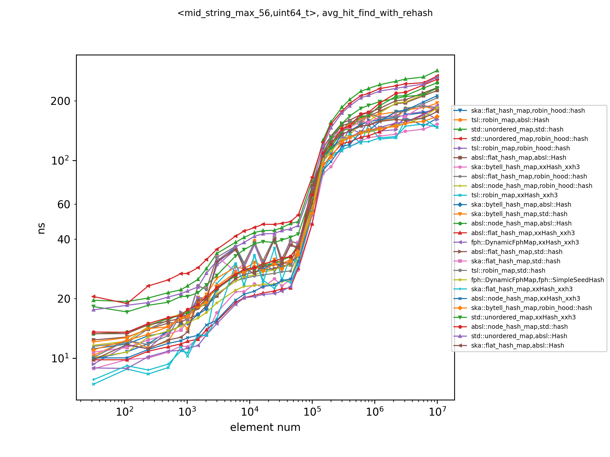

<center>Figure 20: Look up keys in the map with 0.9 max_load_factor, tested in AMD 3990x</center>

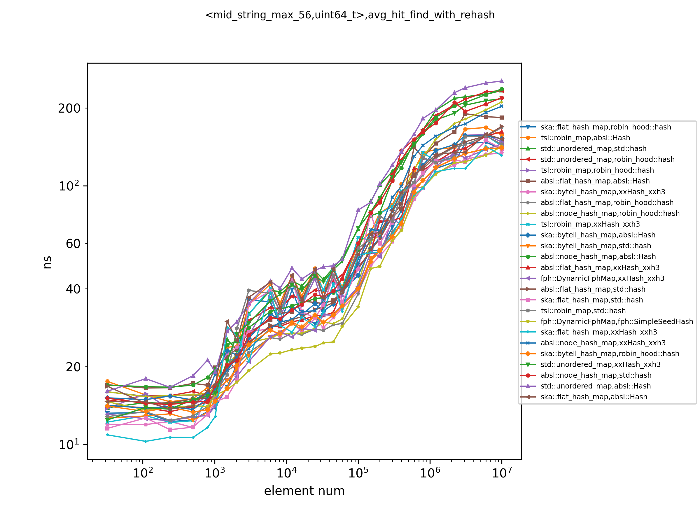

<center>Figure 21: Look up keys in the map with 0.9 max_load_factor, tested in Apple M1 Max</center>

It can be found from the test results that hash `xxHash_xxh3` performs better on the x86-64 platform on the data
tested here, while hash `robin_hood::hash` is better on the arm64 platform.

When the amount of data is small or is very large, both hash `ska::flat_hash_map` and `tsl::robin_map` have the fastest
lookup speed (`tsl::robin_map` does not perform so well on the arm64 platform).

On the x86-64 platform, the lookup speed of `fph::DynamicFphMap` and `absl::flat_hash_map` is the fastest when the
amount of data is moderate. On the arm64 platform, `fph::DynamicFphMap` has very extraordinary query performance when
the amount of data is moderate and very large. `ska::bytell_hash_map` has a competitive performance on all scales of
data on both platforms.

Again, like the string dataset with a maximum length of 12 bytes, this random-length dataset is very unrepresentative.
The length distribution of strings in different application scenarios is completely different, and more specific data
sets should be tested to obtain accurate results.

### <K,V>: <Mid string with fixed length of 56, uint64_t>

#### Look up keys in the map with large max_load_factor


<center>Figure 22: Look up keys in the map with 0.9 max_load_factor, tested in AMD 3990x</center>

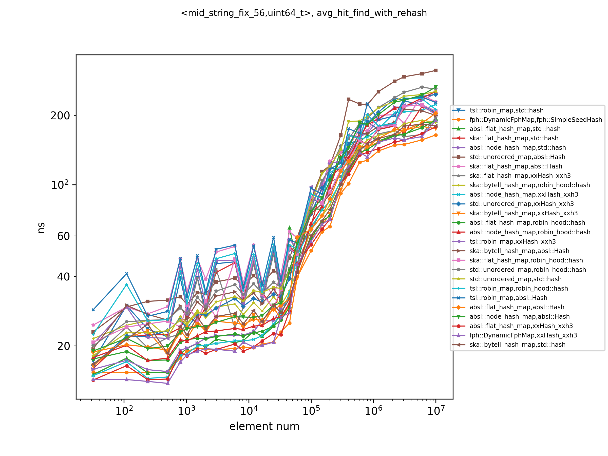

<center>Figure 23: Look up keys in the map with 0.9 max_load_factor, tested in Apple M1 Max</center>

For this dataset, lookup performance again shows somewhat different results on two platforms with different instruction
sets.

On x86-64 platforms, `xxHash_xxh3` is the fastest hash function that works with a hash table. `fph::DynamicFphMap` has
the fastest lookup speed when there is little data. `absl::flat_hash_map` has excellent lookup performance no matter
what data size, especially when the amount of data is large.

On the arm64 platform,  no hash function is the fastest with all hash tables. `xxHash_xxh3` and `fph::SimpleSeedHash`
(which is almost the same as `robin_hood::hash` when key type is string) have their advantageous data sizes when paired
with different hash tables. `fph::DynamicFphMap` combined with `xxHash_xxh3` has the fastest lookup performance on
smaller data sizes.  `fph::DynamicFphMap` using `fph::SimpleSeedHash` and `absl::flat_hash_map` using `xxHash_xxh3`
have superior lookup performance on all data sizes.  The combination of `fph::DynamicFphMap` and  `fph::SimpleSeedHash`
is the fastest especially when the data size is large.

### <K,V>: <uint64_t with bits in low position masked out, uint64_t>

#### Look up keys in the map with large max_load_factor

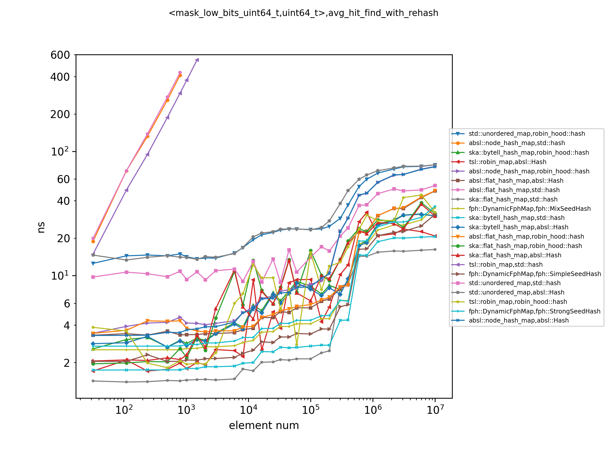

<center>Figure 24: Look up keys in the map with 0.9 max_load_factor, tested in AMD 3990x</center>

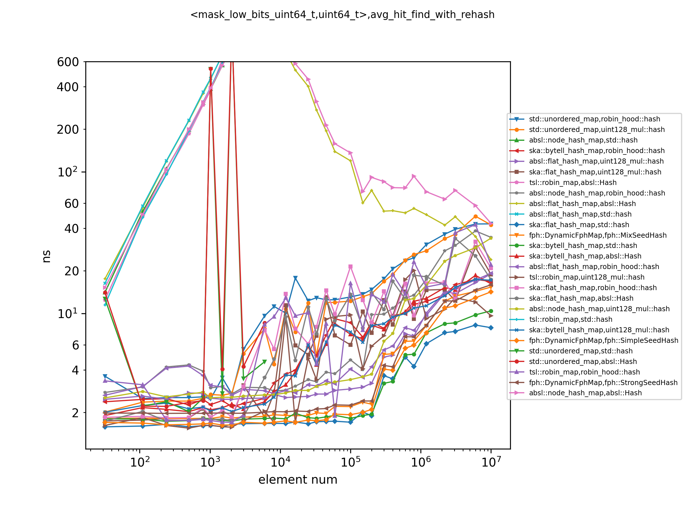

<center>Figure 25: Look up keys in the map with 0.9 max_load_factor, tested in Apple M1 Max</center>

The keys in this test data are integers whose bits in the high positions will change while other bits remain the same.
Data patterns with this characteristic sometimes occur when the developers construct 64-bit integers with keys shorter
than 64 bits. And if the hash function or hash table cannot handle the high-order bit information well,
it will have poor performance.

On the x86-64 platform, when `std::hash` is used, both `ska::flat_hash_map` and `ska::bytell_hash_map` perform quite
well. This may be because the [Fibonacci hashing](https://probablydance.com/2018/06/16/fibonacci-hashing-the-optimization-that-the-world-forgot-or-a-better-alternative-to-integer-modulo/)
used internally by these two hash tables is well suited for data of this nature.

On the arm64 platform, `ska::flat_hash_map` and `ska::bytell_hash_map` also perform extremely well. At the same time,
`fph::DynamicFphMap` has almost the same excellent performance. This performance should come from the fact that they hit
the right slot almost in one shot on this data distribution. At the same time, we note that for those hash tables that
rely on good hash functions, in addition to the poor performance when using `std::hash`, using `absl::hash` also brings
disastrous performance. This should be caused by the poor hashing properties of the implementation of `absl::hash` on
the arm64 platform. At least that's how it turns out in January 2022, when it's tested.

## Conclusion

Reviewing our test results, we can find that the performance is different for different key types, different operation
types, different data scales, different data distributions, and different machine platforms.

The results we show are only for ideal test environments on some common data distributions and common machine platforms.
The reality is often much more complicated. Therefore, if users want to choose the most suitable hash table and hash
function, they can refer to the results of this benchmark to heuristically filter some candidates, and then use their
own test data to test what is most suitable for the specific environment.

Although we've left out a lot of testing, there are still quite a few diagrams in this document and a lot more that
aren't shown. If necessary, you can go to the "results" directory to view the csv data and use the visualization script
we provide to plot.

Time to make some suggestions. If the developer doesn't care about the performance of the hash table at all, then the
hash table in the STL is sufficient. If performance is critical, then some choices need to be made.

Generally speaking, from the results we have, we first need to pick a pair of hash function and hash table. For example,
for integer data, `ska::flat_hash_map` which is not very demanding on hash functions is almost always best with
`std::hash`, which is computationally fast, and similarly, `fph::DynamicFphMap` is almost always best with
`fph::SimpleSeedHash`. And for other hash tables, it is more appropriate to cooperate with a real hash function
such as `uint128_mul::hash` (`absl::hash` on x86-64). If it is a string type of key, the `xxHash_xxh3` is often the
fastest and good enough on the x86-64 platform, while the performance of the `robin_hood::hash` on the arm64 platform
is better.

In most cases, if the data size is small, `ska::flat_hash_map` can perform very well. And if the data size becomes
larger, there are more situations to consider.

If you need the comprehensive performance of insert, find, delete, etc., then you can't choose `fph::DynamicFphMap`,
which is very slow to insert. You should choose other Hash Tables. And if you value lookups very much and insert and
delete operations less, then `fph::DynamicFphMap` has the best performance for most data. Again, make decisions based
on specific data and specific tests.
